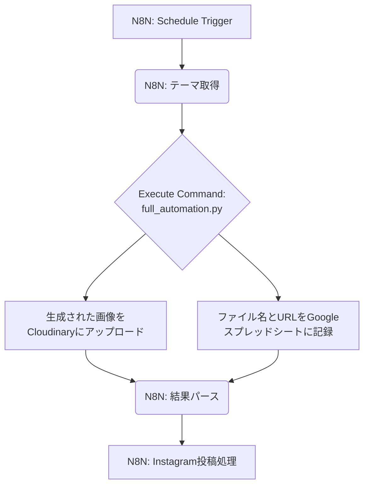

> [!NOTE]
> このドキュメントは、`Mocha the Coffee Penguin` プロジェクトの画像・動画生成からCloudinaryへの自動アップロード、そしてスプレッドシートへの記録までを一気通貫で行うシステムの技術仕様書です。

# 🤖 完全自動化システム：メディア生成・アップロード・記録

このシステムは、プロンプトから画像や動画を生成し、Cloudinaryに自動でアップロード、そしてその結果をGoogleスプレッドシートに記録する一連のプロセスを自動化します。

## ✨ 主な機能

- **メディア生成**: Manus Antigravity API (Gemini) や Nano Banana を利用して、プロンプトに基づいた高品質な画像・動画を生成します。
- **Cloudinary連携**: 生成されたメディアをCloudinaryの指定フォルダに自動でアップロードし、公開URLを取得します。
- **スプレッドシート記録**: アップロードされたメディアのファイル名、Cloudinary URL、生成プロンプト、日時などをGoogleスプレッドシートに自動で記録・管理します。
- **N8N統合**: これらのプロセス全体をN8Nワークフローとして統合し、定期実行や手動実行が可能です。

## ⚙️ システム構成

本システムは、以下のコンポーネントで構成されています。

1.  **Pythonスクリプト**: メインの処理を実行する3つのPythonスクリプト。
    -   `generate_upload_cloudinary.py`: メディア生成とCloudinaryアップロードを担当。
    -   `spreadsheet_manager.py`: Googleスプレッドシートへの接続とデータ記録を担当。
    -   `full_automation.py`: 上記2つのスクリプトを統合し、一連の処理を実行するエンドポイント。
2.  **N8Nワークフロー**: 全体のオーケストレーションを担当。
    -   `n8n_workflow_complete.json`: 定期実行トリガー、Pythonスクリプトの実行、結果のパース、Instagram投稿までを含む完全なワークフロー。
3.  **環境変数ファイル (`.env`)**: APIキーや設定情報を安全に管理。

### ワークフロー図



## 🚀 セットアップ手順

### 1. 必要なライブラリのインストール

```bash
sudo pip3 install cloudinary python-dotenv gspread google-auth-oauthlib google-auth-httplib2
```

### 2. 環境変数の設定

プロジェクトのルートに `.env` ファイルを作成し、以下の情報を設定します。

```dotenv
# Manus Antigravity API
MANUS_API_KEY='your_manus_api_key'

# Cloudinary
CLOUDINARY_CLOUD_NAME='your_cloud_name'
CLOUDINARY_API_KEY='your_cloudinary_api_key'
CLOUDINARY_API_SECRET='your_cloudinary_api_secret'

# Google Cloud & Google Sheets
# サービスアカウントのJSONキーファイルへのパス
GOOGLE_CREDENTIALS_PATH='/path/to/your/credentials.json'
# 記録対象のスプレッドシートID
GOOGLE_SPREADSHEET_ID='your_spreadsheet_id'

# Instagram & Discord (N8N用)
PAGE_ACCESS_TOKEN='your_facebook_page_access_token'
INSTAGRAM_ACCOUNT_ID='your_instagram_business_account_id'
DISCORD_WEBHOOK_URL='your_discord_webhook_url'
```

#### Googleサービスアカウントの設定

1.  [Google Cloud Console](https://console.cloud.google.com/)でプロジェクトを作成します。
2.  「Google Drive API」と「Google Sheets API」を有効にします。
3.  サービスアカウントを作成し、キー（JSON形式）をダウンロードします。
4.  ダウンロードしたJSONファイルをサーバーの安全な場所に配置し、`GOOGLE_CREDENTIALS_PATH`にそのパスを設定します。
5.  作成したサービスアカウントのメールアドレスを、対象のGoogleスプレッドシートの「共有」設定で「編集者」として追加します。

### 3. N8Nワークフローのインポート

1.  N8Nにログインします。
2.  「New Workflow」→「Import from File」。
3.  `automation/n8n_workflow_complete.json` を選択してインポートします。
4.  N8Nの環境変数に、`.env`ファイルと同じ値を設定します。

## 実行方法

### スクリプト単体での実行

個別の機能をテストする場合、各スクリプトを直接実行できます。

**例：完全自動化スクリプトの実行**

```bash
cd /home/ubuntu/coffee_penguin/automation

python3 full_automation.py \
  --prompt "夕暮れのカフェでコーヒーを飲むモカ" \
  --type image \
  --prefix "test_run"
```

| 引数             | 説明                                           | デフォルト値     |
| ---------------- | ---------------------------------------------- | ---------------- |
| `--prompt`       | 生成プロンプト（必須）                         | -                |
| `--type`         | メディアタイプ (`image` or `video`)            | `image`          |
| `--prefix`       | ファイル名のプレフィックス                     | `mocha`          |
| `--aspect-ratio` | アスペクト比（画像のみ）                       | `3:4`            |
| `--duration`     | 動画の長さ（秒、動画のみ）                     | `5`              |
| `--worksheet`    | スプレッドシートのワークシート名               | `メディア管理`   |

### N8Nワークフローでの実行

- **手動実行**: N8Nのワークフロー画面で「Execute Workflow」をクリックします。
- **自動実行**: デフォルトでは、毎日日本時間19時に自動で実行されます（CRON式: `0 0 19 * * *`）。

## 📂 ファイル構成

```
automation/
├── README_CLOUDINARY.md       # このドキュメント
├── generate_upload_cloudinary.py # メディア生成・Cloudinaryアップロード
├── spreadsheet_manager.py      # Googleスプレッドシート連携
├── full_automation.py          # 統合スクリプト
├── n8n_workflow_complete.json  # N8Nワークフロー定義
└── date_theme.py               # 日付に応じたテーマを返す（既存）
```

## ⚠️ 注意事項

- **APIキーの管理**: `.env` ファイルやサービスアカウントのJSONキーは、Gitリポジトリに含めないなど、厳重に管理してください。
- **Cloudinaryのフォルダ**: アップロードされたメディアは、Cloudinary上で `mocha` というフォルダに格納されます。このフォルダ名は `generate_upload_cloudinary.py` 内で変更可能です。
- **エラーハンドリング**: スクリプトには基本的なエラーハンドリングが含まれていますが、本番運用ではさらに堅牢な監視・通知の仕組みを検討してください。
