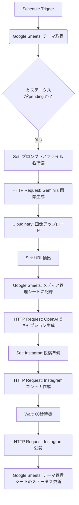

> [!NOTE]
> このドキュメントは、「Mocha the Coffee Penguin」プロジェクトの**N8Nだけで完結する**自動投稿システムの技術仕様書です。

# 🤖 N8N完結型 自動投稿システム

このシステムは、**Pythonスクリプトや外部サーバーを一切使用せず**、N8Nのノードだけで以下の処理を完全に自動化します。

1.  **テーマ取得**: Google Sheetsから投稿テーマを取得
2.  **画像生成**: Gemini APIで画像を生成
3.  **アップロード**: Cloudinaryに画像をアップロード
4.  **記録**: Google Sheetsに結果を記録
5.  **キャプション生成**: OpenAI APIでキャプションを生成
6.  **Instagram投稿**: Instagram Graph APIで投稿

## ✨ 主な特徴

- **サーバーレス**: Pythonスクリプトや外部サーバーが不要なため、運用コストを削減できます。
- **ノーコード/ローコード**: すべての処理がN8Nのビジュアルインターフェース上で完結します。
- **メンテナンス性**: ワークフローの修正や拡張が容易です。
- **完全自動化**: 毎日日本時間19時に自動で実行されます。

## ⚙️ システム構成

本システムは、すべてN8Nの標準ノードとコミュニティノードで構成されています。

### ワークフロー図



## 🚀 セットアップ手順

### 1. 必要なN8Nノードのインストール

N8Nのノードパネルから、以下のノードがインストールされていることを確認してください。

- **Cloudinary**: `n8n-nodes-base.cloudinary`

### 2. N8Nの認証情報（Credentials）の設定

N8Nの「Credentials」セクションで、以下の認証情報を設定します。

| サービス         | 認証タイプ                | 必要な情報                                                                                                |
| ---------------- | ------------------------- | --------------------------------------------------------------------------------------------------------- |
| **Google Sheets**| `Google OAuth2 API`       | Google Cloudで作成したOAuth 2.0クライアントIDとシークレット。リダイレクトURIにN8NのURLを設定する必要があります。 |
| **Cloudinary**   | `Cloudinary API`          | Cloud Name, API Key, API Secret                                                                           |
| **OpenAI**       | `Header Auth`             | `Authorization`ヘッダーに`Bearer {YOUR_OPENAI_API_KEY}`を設定                                              |

### 3. N8Nの環境変数（Environment Variables）の設定

N8Nの環境変数に、以下の情報を設定します。

```dotenv
# Google Sheets
GOOGLE_SPREADSHEET_ID=\'your_spreadsheet_id\'

# Gemini API
GEMINI_API_KEY=\'your_gemini_api_key\'

# Instagram Graph API
PAGE_ACCESS_TOKEN=\'your_facebook_page_access_token\'
INSTAGRAM_ACCOUNT_ID=\'your_instagram_business_account_id\'

# OpenAI API (Header Authで設定済みの場合は不要)
OPENAI_API_KEY=\'your_openai_api_key\'
```

### 4. Google Sheetsの準備

指定したスプレッドシートに、以下の2つのシートを作成します。

#### ① `テーマ管理` シート

| A列 (date) | B列 (theme) | C列 (status) |
| :--------- | :---------- | :----------- |
| 2026-02-10 | バレンタイン | pending      |
| 2026-02-11 | 建国記念の日  | pending      |

- ワークフローは`status`が`pending`の行を取得し、処理後に`posted`に更新します。

#### ② `メディア管理` シート

| A列 (filename) | B列 (cloudinary_url) | C列 (type) | D列 (prompt) | E列 (date) |
| :------------- | :------------------- | :--------- | :----------- | :--------- |
| (自動入力)     | (自動入力)           | (自動入力) | (自動入力)   | (自動入力) |

- このシートは、ワークフローが初回実行時に自動で作成します。

### 5. N8Nワークフローのインポート

1.  N8Nにログインします。
2.  「New Workflow」→「Import from File」。
3.  `automation/n8n_workflow_pure.json` を選択してインポートします。
4.  各ノードの認証情報が正しく設定されているか確認します。

## 実行方法

- **手動実行**: N8Nのワークフロー画面で「Execute Workflow」をクリックします。
- **自動実行**: デフォルトでは、毎日日本時間19時に自動で実行されます（CRON式: `0 0 19 * * *`）。

## 📂 ファイル構成

```
automation/
├── README_N8N_PURE.md       # このドキュメント
└── n8n_workflow_pure.json   # N8Nワークフロー定義
```

## ⚠️ 注意事項

- **APIキーの管理**: N8Nの認証情報と環境変数は、安全に管理してください。
- **Gemini APIの制限**: Gemini APIには、無料利用枠やリクエスト数に制限があります。詳細はGoogleの公式ドキュメントをご確認ください。
- **エラーハンドリング**: ワークフローには基本的なエラーハンドリングが含まれていません。本番運用では、エラー発生時に通知する仕組み（例: Discord通知ノード）を追加することを推奨します。
